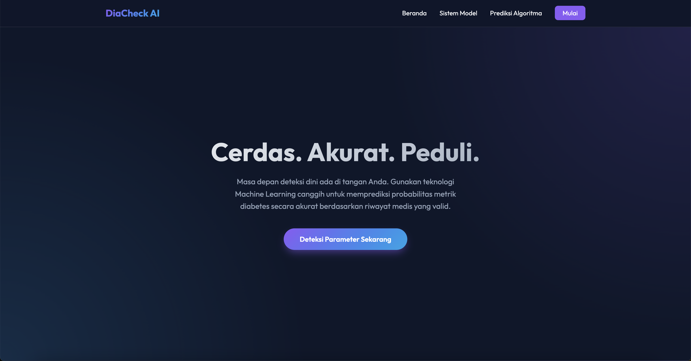
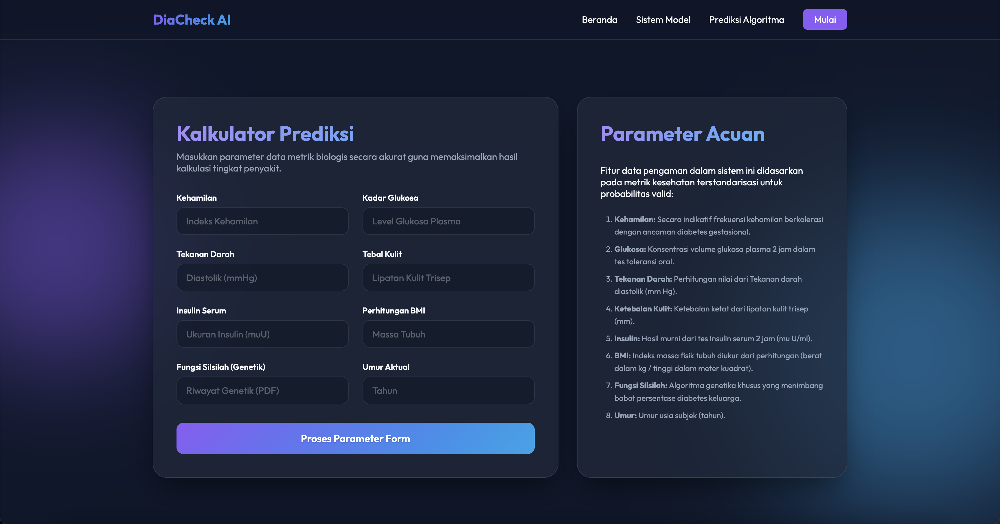
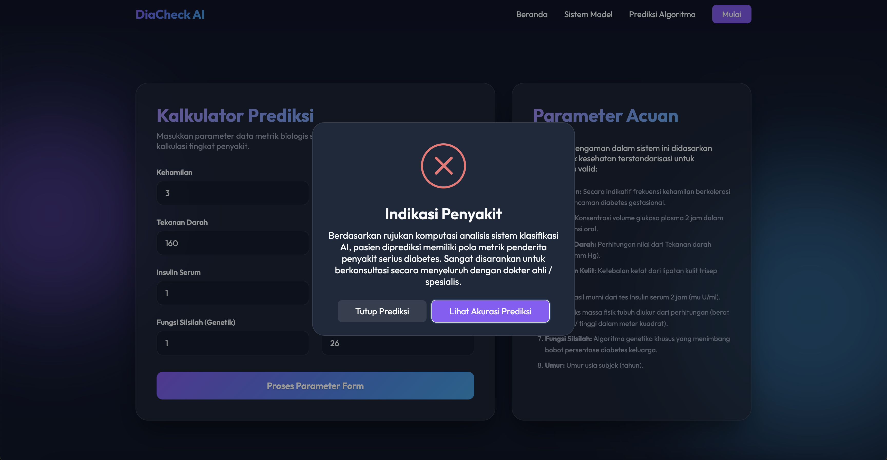
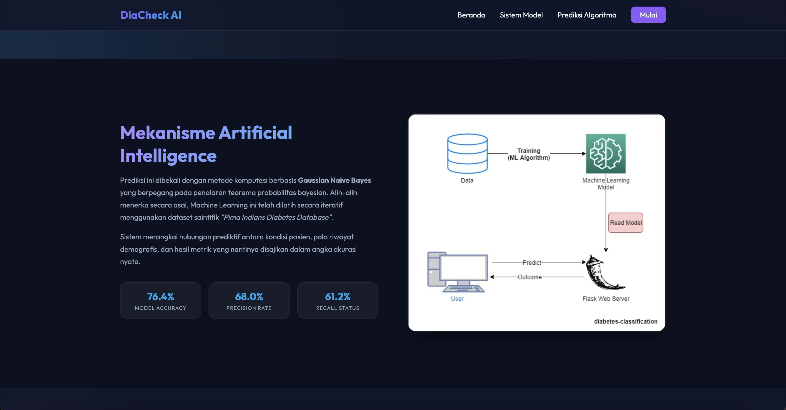
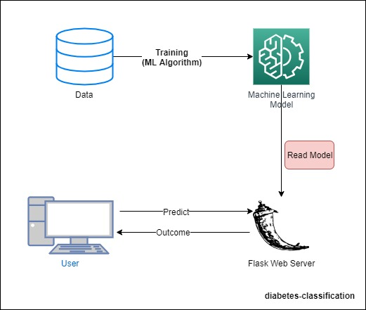
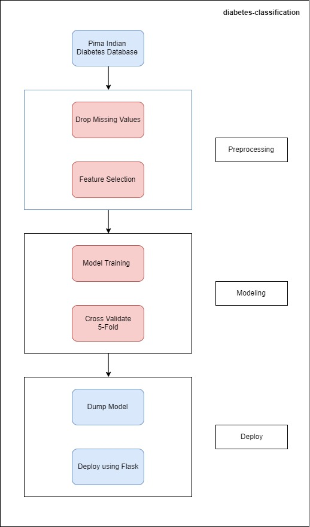

# 🩺 DiaCheck AI: Klasifikasi Diabetes Berbasis Machine Learning

Cerdas. Akurat. Peduli. **DiaCheck AI** adalah aplikasi web berbasis *Machine Learning* yang dibangun menggunakan Python (Flask) dan Scikit-Learn. Aplikasi ini berfungsi sebagai prediksi indikasi awal diabetes berdasarkan masukan (*input*) data medis yang disesuaikan secara statistik dengan profil rekam jejak pasien sungguhan.

---

## ✨ Fitur Utama
- **Prediksi Akurat & Instan:** Memprediksi probabilitas seseorang menderita diabetes berdasarkan 8 metrik kesehatan (Kehamilan, Glukosa, Tekanan Darah, Ketebalan Kulit, Insulin, BMI, Fungsi Silsilah Genetik, dan Umur).
- **Desain UI Modern (Glassmorphism):** Tampilan *Landing Page User Interface* (UI) interaktif bertema gelap (*dark mode*) yang dioptimalkan dengan efek *glassmorphism* menggunakan Vanilla CSS terbaru.
- **Transparan (Explainable AI):** Memberikan informasi mendetail mengenai seberapa dapat diandalkannya hasil dari model komputasi yang digunakan.
- **Papan Skor Model Internal:** Pengguna dapat dengan mudah melihat metrik bawaan model, yakni Accuracy: **76.43%**, Precision: **68.04%**, dan Recall: **61.19%**.
- **Interaksi Popup Pintar:** Didukung oleh animasi *SweetAlert2* untuk hasil kalkulasi yang mudah dipahami.

---

## 🛠 Teknologi yang Digunakan
**Backend:**
- [Python 3.9+](https://www.python.org/)
- [Flask](https://flask.palletsprojects.com/) (Web Framework)
- [Scikit-Learn](https://scikit-learn.org/) (Model Gaussian Naive Bayes)
- [Numpy](https://numpy.org/) & [Pandas](https://pandas.pydata.org/) (Pra-pemrosesan Data)
- `gunicorn` (Untuk kemudahan Deployment Server)

**Frontend:**
- HTML5 (Semantik)
- Vanilla CSS3 (Custom Responsive & Glassmorphism Theme) 
- Vanilla JavaScript & SweetAlert2

---

## 📸 Cuplikan Aplikasi (Screenshots)

| Halaman Utama | Form Prediksi |
| :---: | :---: |
|  |  |

| Hasil Prediksi | Mekanisme Sistem |
| :---: | :---: |
|  |  |

| Cara Kerja AI | Tahapan Pembuatan |
| :---: | :---: |
|  |  |

---

## 🚀 Instalasi & Menjalankan di Komputer Lokal

Bila Anda ingin mencoba menjalankan atau memodifikasi source-code secara lokal, ikuti langkah-langkah mudah di bawah ini.

### 1. Prasyarat
Pastikan Anda memiliki [Python 3.9 atau yang lebih baru](https://www.python.org/downloads/) terinstall di dalam sistem Anda. Disarankan juga memiliki ekstensi editor penulisan kode seperti **VS Code**.

### 2. Kloning Repositori (Opsional)
```bash
git clone https://github.com/wirantositinjak/diabetes-classification-nb.git
cd diabetes-classification-nb
```

### 3. Buat Virtual Environment (Sangat Disarankan)
Gunakan *Virtual Environment* untuk menyekat instalasi modul agar tidak bentrok dengan modul lokal di sistem operasi (seperti macOS/Windows).
```bash
python3 -m venv venv

# Aktifkan untuk pengguna Linux/Mac OS:
source venv/bin/activate

# Aktifkan untuk pengguna Windows (Command Prompt):
venv\Scripts\activate
```

### 4. Install Dependencies
```bash
pip install -r requirements.txt
```
*(Catatan: Versi bawaan dependency dapat diperbarui karena alasan kompabilitas di arsitektur ARM64 modern)*

### 5. Jalankan Aplikasi
```bash
python3 app.py
```

Buka peramban internet (*browser*) favorit Anda dan meluncurlah pada alamat server pengembangan lokal berikut: **`http://127.0.0.1:5000/`**

---

## 🧠 Tentang Model Prediksinya
Sistem AI yang mengendalikan kalkulator kecerdasan prediktif ini dilatih memanfaatkan algoritma **Gaussian Naive Bayes**. Naive Bayes adalah pendekatan probabilistik dari *Teorema Bayes* yang berasumsi bahwa setiap fitur prediksi berdiri independen satu sama lain. 

Model prediktif (`model_nb.pkl`) di-*train* dan diajarkan menggunakan set data (*dataset*) **Pima Indians Diabetes Database** dari repositori *Kaggle* / *UCI Machine Learning Repository*.

---

## 🌐 Publikasi (Deployment)
Karena proyek ini dilengkapi dengan `Procfile` dan `gunicorn` serta arsitektur yang ringan, maka `DiaCheck AI` sudah **"Siap Produksi"** (*Production Ready*). Sangat direkomendasikan untuk men-*deploy* aplikasi ini di platform *Platform-as-a-Service* (PaaS) modern seperti:
- **[Render](https://render.com/)** *(Sangat disarankan - gratis, mudah)*
- **[Railway](https://railway.app/)**
- **Heroku** (menggunakan tipe server penanganan *web: gunicorn app:app*)

---

## 👨‍💻 Kontributor
**Wiranto Millennium S**
- [LinkedIn Profile](https://www.linkedin.com/in/wirantomillennium/)
- [GitHub Profile](https://github.com/wirantositinjak)

---
*Dibuat menggunakan dedikasi untuk inovasi pendeteksian kesehatan tingkat lanjut berbasis komputer. Hak cipta dilindungi.*
